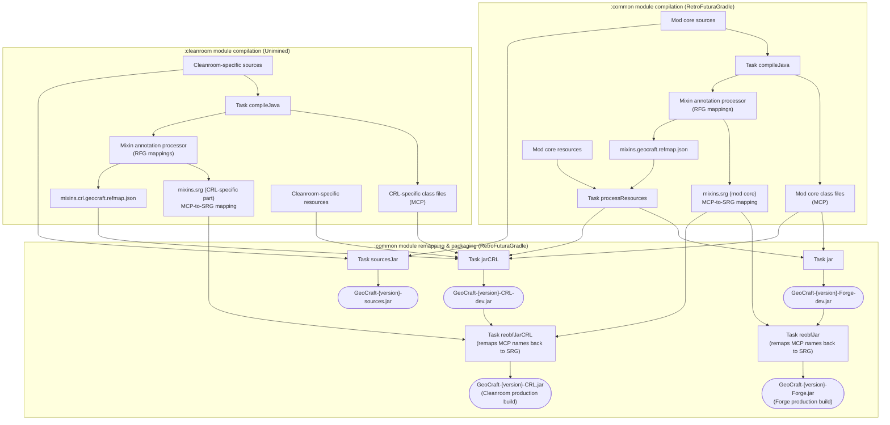

# GeoCraft

**Switch Language**: [简体中文](https://github.com/QGMoe/GeoCraft/blob/master/README.md) | **English**


[](https://www.mcmod.cn/class/22470.html)
[](https://www.curseforge.com/minecraft/mc-mods/qg-geocraft)
[](https://modrinth.com/project/3CKJAWbv)
[](https://github.com/QGMoe/GeoCraft)


[](https://github.com/QGMoe/GeoCraft/wiki)

GeoCraft (天圆地方) is a mod dedicated to bringing geography into Minecraft. While adding as few new blocks, items and other elements as possible, it modifies game mechanics in every way it can to make the Minecraft world behave more like the real one — bringing real geography into Minecraft.

The mod is still in early development: its features are incomplete and stable operation is not guaranteed. If you run into a bug, feel free to open an Issue above — and remember to attach the log~

The main features implemented so far:

- A fluid physics system
- A still-far-from-complete atmosphere system — visual effects, client-server synchronisation and a regional weather system are not implemented yet
- A soil moisture system
- Plus a pile of assorted smaller features, described below

The mod also ships highly customisable configuration files and provides a feature-rich API that allows third-party mods to build more and better functionality. If you have a feature suggestion that isn't implemented yet, feel free to open an Issue!

## Fluid Physics

As the name suggests, the fluid physics system makes fluids in Minecraft behave more realistically. GeoCraft's fluid physics is inspired by the mods [Fluid Physics](https://github.com/lhns/mc-fluid-physics) and [Water Physics Overhaul](https://github.com/Sasai-Kudasai-BM/Water-Physics-Overhaul): the VANILLA LIKE mode corresponds to the former and the MORE REALITY mode to the latter. If you don't want fluid physics at all, there is also a VANILLA mode that keeps the vanilla logic. MORE REALITY is the default.

Note that in the upcoming 0.3.x versions, the VANILLA LIKE and MORE REALITY modes will be renamed to CLASSIC and FINITE respectively, while VANILLA stays unchanged. **The rest of this document refers to the two modes by their new names.**

### FINITE Mode

FINITE is the fluid physics mode enabled by default. It completely changes how fluids flow as well as how they look: the vanilla concept of fluid sources is entirely replaced by the new concept of layers (Quanta / Layer). This layer-based way of representing fluids is also referred to in this mod as the Finite Design. In FINITE mode:

- Every bit of fluid is **real** and **finite**;
- Fluids **spread outward** on a horizontal surface;
- Fluids flow **downhill** (fluids with negative density flow the opposite way), including vertical flow and slope flow (disabled by default);
- When a block is placed into a fluid, the fluid fills that block as much as possible, and any remainder **flows outward** instead of vanishing;
- Denser fluids sink below less dense ones;
- **Soil system interaction**:
  - Water (or other supported fluids) spontaneously infiltrates into **fluid host blocks** (note that this concept is different from waterlogged blocks), or evaporates;
- **Atmosphere system interaction** (requires the atmosphere system and the corresponding features to be enabled in the dimension):
  - Water freezes when the surface temperature drops below 0 °C (due to vanilla block limitations, partially filled water freezes into snow of the corresponding height);
  - Snow and ice melt when the surface temperature rises above 0 °C;
  - When it rains, if there is **enough water vapour**, a patch of water is randomly generated on the ground.

The Finite Design underlying FINITE mode is fundamentally incompatible with the Classic Design used by vanilla (which records flow state as levels, where the visual volume does not represent the actual amount of fluid). This means redstone machines and automated farms that rely on vanilla fluid behaviour are very likely to break, and there is a new learning curve. If you have played [Water Physics Overhaul](https://github.com/Sasai-Kudasai-BM/Water-Physics-Overhaul) or its 1.20+ successor Flowing Fluids, the above may feel familiar.


### CLASSIC Mode

If you want fluid physics but can't accept the sweeping changes of FINITE mode, and you'd like better average performance, try CLASSIC mode. It is based on vanilla's own Classic Design (flow state recorded as levels; visual volume does not represent the actual amount of fluid), with physics-oriented changes on top — namely, fluid sources move in a physically plausible way. Specifically:

- As in vanilla, the concept of fluid sources still exists;
- Fluid sources flow **downhill** whenever possible (fluids with negative density flow the opposite way), including vertical flow and source-tracing flow;
- On a horizontal surface, the vanilla spreading behaviour is kept;
- Denser fluids move below less dense ones.

Performance-wise, CLASSIC currently falls behind FINITE (driven by the multithreaded pressure system) during sudden large-scale fluid movement, but because it works by moving fluid sources at the bottom layer, the system as a whole converges very quickly — so it avoids the prolonged stutters FINITE can exhibit.

### Pressure System

GeoCraft implements a high-performance **pressure system** for fluids, replacing the vanilla single-threaded slope flow algorithm. The pressure system is enabled by default and can run its computation asynchronously on multiple dedicated threads, which greatly reduces MSPT when large amounts of fluid are flowing. However, since pressure computation needs to store working data, memory usage can get rather high during large-scale fluid movement. With the pressure system enabled, allocating at least 4 GB of JVM heap is recommended; otherwise GC (the JVM's memory reclamation mechanism) may run garbage collection very frequently.

So far the pressure system only supports FINITE mode; CLASSIC support will come in the future.

The image below shows a river created by a repeating command block: after winding through a twisting glass cave, it exits at the lower left as a waterfall. The pressure system plays a crucial role in making the siphon effect work.


## Atmosphere System

The mod implements a **dynamic atmosphere system** computed in real time from in-game data, with the in-game ID `surface` (the Overworld/surface atmosphere system; the Chinese name is still tentative). This atmosphere system runs independently of vanilla biomes: it only uses biome data during initialisation and relies on **real-time game data** afterwards — which means player activity genuinely changes the climate!

Note that this atmosphere system is still in **early development**. Its simulation of unusual situations (such as floating islands) can be badly distorted, and strange behaviour shows up from time to time. The `surface` atmosphere system is, at its core, an extremely simplified climate model; even if it looks fine in the short term, it is not suitable for long-term play. Unless you are genuinely interested in climate simulation and willing to test it, for long-term use of this mod it is recommended to switch to the `vanilla` atmosphere system (the static, biome-data-based atmosphere system) via the configuration file.

That's right — besides `surface`, the atmosphere system has multiple implementations (a vanilla mode [biome-based], and a closed mode [a sealed, constant-temperature atmosphere]), and third-party mods can add more atmosphere systems. More preset atmosphere systems will also be added to this mod in the future. You can also set a dimension's atmosphere system to `none` to disable it entirely — but note that a dimension with its atmosphere system disabled is not the same as a dimension without an atmosphere.

### Properties

- Atmosphere loading is independent of chunks: the atmosphere is loaded even over unloaded chunks. The atmosphere loading range can be adjusted in the configuration file — note this does not necessarily apply to atmosphere systems added by third-party mods;
- The atmosphere systems provided by this mod update once every 60 game ticks, a period called an Atmosphere Tick. Ideally only one sixtieth of the atmosphere updates per game tick, so under normal circumstances the atmosphere system has almost no performance impact;
- In the save folder you can find atmosphere region files under `DIMx/atmosphere`, a binary format used to store atmosphere data. If you may ever want to switch back to the previous atmosphere system, remember to back up these files before switching.

Everything below applies to the `surface` atmosphere system:

- Water vapour is transported through the atmosphere, and rain only falls where there is enough of it;
- Phase changes of water affect the energy exchange between the ground and the atmosphere. For example, snow-covered ground not only reflects more shortwave radiation — melting snow also absorbs heat and slows warming;
- Ground heat capacity and albedo affect how ground and atmosphere temperatures evolve, which can give rise to local thermal circulation (pending experimental verification);
- (Planned) a regional weather system.

## Soil (Moisture) System

GeoCraft introduces a mechanism called the "**Layered Fluid Host Block**" — "fluid host block" for short — and builds soil hydrology simulation and several other mechanics on top of it. The API behind fluid host blocks is an interface for fluid storage and exchange: it defines how fluids are stored inside a block and the basic ways fluids move between blocks. By definition, waterlogged blocks are, set-theoretically, a subset of fluid host blocks (waterlogged blocks ⊆ fluid host blocks). For example: dirt, grass blocks and sand are not waterlogged blocks, yet they are all permeable to water; stairs are waterlogged blocks and should be considered fluid host blocks as well.

The soil system brings fresh gameplay. For example, because soil is permeable, building a basement in a relatively humid biome becomes a somewhat tricky task — you have to guard against every potential leak (requires MORE REALITY). Conversely, sand at suitable moisture no longer collapses so easily and can form stable structures.

Soil (and other fluid host blocks) behaves rather differently under the different fluid physics modes, but most soil hydrology mechanics only take effect in the MORE REALITY mode.

Soil (like most other fluid host blocks) is not implemented by adding new blocks; instead, the block states of existing blocks are extended via Mixin. This means that although the mod appears to add no new blocks, you cannot casually uninstall it — otherwise some modified blocks will end up as abnormal variants of their block types.

The soil system does not yet support soils added by third-party mods, such as the grass blocks from Biomes O' Plenty (BOP). A long-term compatibility plan is in place.

## Assorted Other Features

- To let vanilla clients connect to servers running this mod, the mod enables its network communication modification feature on the server by default. It rewrites the packets sent to every player, mapping the extended block states back to block states a vanilla client can read, thus staying compatible with vanilla clients. This does mean, however, that players cannot read the water content or other information of any block except farmland, which raises the difficulty somewhat. The mechanism may also slightly increase the server's packet-sending overhead;
- Snow mechanics (including snow blocks) are heavily adjusted, especially in FINITE mode;
- Farmland moistening is substantially reworked in FINITE mode — see the MORE REALITY game mechanics page on mcmod.cn for details.

## Requirements

This mod requires [MixinBooter](https://github.com/CleanroomMC/MixinBooter) as a dependency to provide the Mixin environment. The mod can be installed server-side only, but installing it on both sides gives the best experience. On the Cleanroom loader, MixinBooter is not required.

Since v0.2.7, GeoCraft actively supports the Cleanroom loader and publishes production builds for both Forge and Cleanroom. Note that although Cleanroom's strong backward compatibility currently allows GeoCraft's Forge build to run on Cleanroom, the mod does not guarantee that the Forge build remains stable there. To use GeoCraft on the Cleanroom loader, please use the production builds with the CRL suffix (short for Cleanroom Loader).

Due to the limitations of the vanilla 1.12.2 lighting system and render pipeline, without extra optimisation even just a thousand-odd fluid blocks updating simultaneously will make lighting computation send MSPT soaring. Installing a lighting optimisation mod such as [Alfheim Lighting Engine](https://github.com/Red-Studio-Ragnarok/Alfheim) solves this and greatly improves performance during massive fluid updates. The same goes for the client: rendering optimisation mods, such as OptiFine, can smooth out FPS drops when many fluids are updating.

With the pressure system on and multithreaded computation enabled (the default) and the slope flow algorithm disabled, the demand on single-core CPU performance drops in most cases, but memory requirements rise significantly — allocate at least 4 GB of maximum JVM heap. Also, a fully loaded pressure system (say, tens of thousands of fluid blocks updating at once) puts considerable pressure on multi-core CPU performance, so make sure your CPU has decent multi-core capability. If your CPU has a lot of cores — 16 or even 32 — it is worth reading the performance documentation and tuning the configuration.

You can also consult the mod documentation and tune performance through the configuration files.

## Compatibility

- In general, the mod's fluid physics also supports fluids added by other mods, but fluids whose flow implementation has been overridden by their own mod won't get this mod's fluid physics. Good news: the MORE REALITY mode implements support for Immersive Engineering's concrete;
- The MORE REALITY implementation rewrites the pump extraction and fluid placement logic of Immersive Engineering and IndustrialCraft 2, adjustable in the configuration file;
- You can disable the physics of specific fluids in the configuration file;
- If you uninstall this mod, some fluid host blocks whose data values exceed the vanilla block state range will turn into different data values of the same block — dirt may become podzol, sand may become red sand. A lossless uninstall mechanism (or companion mod) may come in the future;
- The network communication modification may conflict with anti-X-ray plugins and other mods or plugins built on similar principles. To avoid this, you can disable the feature in the configuration file. Careful! — once disabled, unless some other mod or plugin rewrites the network traffic instead, vanilla clients (or any client without this mod) will misbehave even worse than described above: none of the extended block states will render correctly;
- If the pressure system's multithreaded implementation causes unacceptable crashes, try disabling multithreading or the pressure system entirely — and ideally send the crash reports to the author;
- The mod is currently incompatible with [Fluidlogged API](https://github.com/jbredwards/Fluidlogged-API). Compatibility work is in progress.
- The author updates documentation on mcmod.cn first. If statements elsewhere (other than the GitHub source code) conflict with mcmod.cn, mcmod.cn prevails. The priority order is: GitHub source code = mcmod.cn > everything else. English documentation is updated on GitHub, but may lag behind the Chinese documentation.

## Q & A

**Q: Are there plans to port the mod to other versions?**

Not for now.

**Q: What else might be added?**

External geological forces, renewable lava, and so on — basically whatever interesting geographic mechanics come to mind. Current plans include:

- Fluid mixing mechanics (e.g. mixing water of different sediment concentration levels);
- Gameplay built on top of this mod;
  - Photovoltaic power generation;
  - Hydroelectric power generation;
  - Body temperature and hydration systems, along with related mod integrations;
- The underground part of the water cycle (aquifers [not real terrain — think Immersive Engineering's mineral veins]);
- A basic geology system (fault zones).

**Q: Will new blocks, entities and the like be added?**

Yes. But any new content that cannot be mapped onto something vanilla already has will ship as an add-on, because such content would force clients to install the mod too, which conflicts with this mod's (current) goal of vanilla-client compatibility.

**Q: Can I put it in a modpack?**

Absolutely! Just note that the mod is still in early development, so be careful when adding it.

**Q: How frequent are updates?**

Due to time constraints, the mod won't see major feature updates for quite a while.

**Q: Are waterlogged blocks implemented?**

No. Waterlogged blocks will be implemented in the future through Fluidlogged API compatibility. The fluid host block API is only a fluid interaction protocol — it is not responsible for the concrete mechanics.

**Q: Isn't Cleanroom backward compatible? Why does Cleanroom need a dedicated build?**

Three factors:
1. Despite the claimed 99% backward compatibility, Cleanroom still has incompatible spots, and GeoCraft needs Cleanroom-specific code for those;
2. On some hot call paths, newer Java or Cleanroom may offer better-performing implementations;
3. The Cleanroom environment also has many new APIs.

But the decisive reason for splitting the jars is Forge — otherwise all the logic could ship in a single jar with no dedicated Cleanroom release. Cleanroom is forward compatible, but Forge is not necessarily backward compatible: Forge on Java 8 may fail to correctly handle a jar containing both Java 8 and Java 25 bytecode, loading the mod incompletely and then crashing. So the releases are split into a Forge build and a CRL build, the latter containing the Cleanroom-specific logic on top of the Forge base.

## Documentation

For more detailed documentation, please note that the English version is currently **much less complete** and may **not** be up-to-date compared to the Chinese documentation. You can visit:

- [MC百科 (mcmod.cn)](https://www.mcmod.cn/class/22470.html) (Most comprehensive, but in Chinese)
- [GitHub Repository Wiki](https://github.com/QGMoe/GeoCraft/wiki) (English documentation available but limited)

The configuration file in-game contains bilingual (English & Chinese) comments for **most** settings.

## Writing Code for This Mod

### Contributing to the Mod Itself

If some part of this mod doesn't satisfy you and needs improvement, you are welcome to contribute code on GitHub via **Pull Request**.

Note that the mod's development toolchain will keep changing for a while. As of now, because it uses Cleanroom's modern Forge development toolchain, developing this mod requires a **Java 25 JDK**. The following changes are expected (in chronological order):

1. [x] Restructure the Gradle project into multiple subprojects;
2. [x] Introduce direct Cleanroom loader support;
3. Write high-performance low-level implementations in Rust via JNI, expected to be used by fluid physics and the atmosphere system;
4. Further automate the build process with GitHub Workflows.

The mod is developed with both RetroFuturaGradle and the Cleanroom team's customised Unimined toolchain. A `build` invocation proceeds as follows (environment preparation and unit tests omitted):



### Writing Add-on Mods

(The following tutorial has not yet been verified in a real project.)

This mod is in early development and its API may change frequently, so writing add-on mods is not recommended. If you still want to, using Modrinth Maven is recommended:

``` groovy
// ForgeGradle
// Dependency format: maven.modrinth:qg_geocraft:<version number>
// The line below adds a compile-time dependency on GeoCraft v0.2.2
compileOnly fg.deobf("maven.modrinth:qg_geocraft:0.2.2")

// Same for RetroFuturaGradle
compileOnly rfg.deobf("maven.modrinth:qg_geocraft:0.2.2")
// To depend on a CRL build, append the -CRL suffix, e.g. "maven.modrinth:qg_geocraft:0.2.7-CRL"
```

CurseForge Maven is not recommended, but it works too:
``` groovy
// ForgeGradle
// Dependency format: curse.maven:qg-geocraft-1423755:<file ID>, see CurseForge for details
// 7599943 is the CurseForge file ID of v0.2.2
compileOnly fg.deobf("curse.maven:qg-geocraft-1423755:7599943")

// Same for RetroFuturaGradle
compileOnly rfg.deobf("curse.maven:qg-geocraft-1423755:7599943")
```

## Did You Know

- GeoCraft was originally created because 1.12.2 lacked a usable fluid physics mod, and during development it drew inspiration from the two well-known fluid physics mods for Minecraft Java 1.15+: Fluid Physics and Water Physics Overhaul. Even so, GeoCraft's entire fluid physics system was built completely from scratch — in the early days it neither referenced nor used any code from those two mods. Had things gone as planned, the mod would not be called GeoCraft at all, but would simply be a fluid physics mod for 1.12.2. Mid-development, however, the author (QiguaiAAAA) — a geography enthusiast — wasn't satisfied with fluid physics as a single system, so an atmosphere system was introduced, followed by a soil system. The mod thus became one dedicated to implementing multiple deeply coupled geographic systems in Minecraft.
- If you read through the implementations of the systems above, you will find that GeoCraft's fluid host block system, atmosphere system, soil system (built on fluid host blocks), and the possible future groundwater system, fault zones and so on, have no fully comparable implementation in any other mod — even where other mods have similar concepts.

---

_Translation assistance for this mod is welcome and appreciated._

_**Note:** This documentation has been translated with the assistance of AI. While every effort has been made to ensure accuracy, please refer to [the original source](https://github.com/QGMoe/GeoCraft/blob/master/README.md) for absolute precision._
